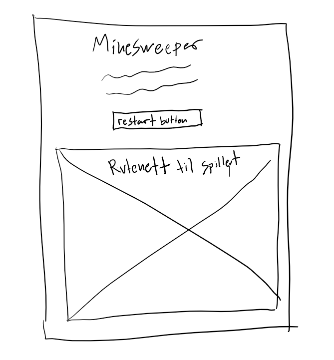

# Minesveiper

Beskrivelse av spillet:

Dette spillet er basert på det kjente minesweeper spillet og det går ut på at man skal finne alle minene i et rutenett, uten å sprenge en eneste. Man avslører om rutene er miner eller ikke ved å venstreklikke på dem og da vil det enten komme et tall på ruten som viser hvor mange miner det er i nærheten, eller så vil mange flere ruter bli avslørt dersom det ikke var noen mine i nærheten av de. Venstreklikker man på en mine så er spillet over. Man kan også høyreklikke på ruter som man vet er miner for å flagge de. Da vil det ikke være mulig å venstreklikke på dem, med mindre du untoggler flagget ved å øyreklikke ruten på nytt. 

## Wireframes

Wireframes som illustrerer layout

## refleksjon

Det jeg mener spillet mangler:

- En bug med spillet er at når du først starter spillet ved å trykke på en rute  i det fulle rutenettet, så kan det hende man trykker på en mine. 
- Spillet er i i tillegg litt tregt når den må sjekke om mange naboruter har mine i seg eller ikke. 
- Noe jeg mener spillet mangler, er muligheten for at spilleren selv kan velge antall rader, kolonner og miner slik at spilleren selv kan justere vanskelighetsgraden på spillet.
- Når det gjelder koden min så kunne jeg nokk brukt mer objekter og klasser i koden min.

## Lisens

Jeg er litt usikker på hvilken lisens jeg ville gått for, men jeg ville nok godt får en som ikke hindrer andre i å endre på produktet mitt og forbedre det. "# it2-avsluttende-oppgave" 
